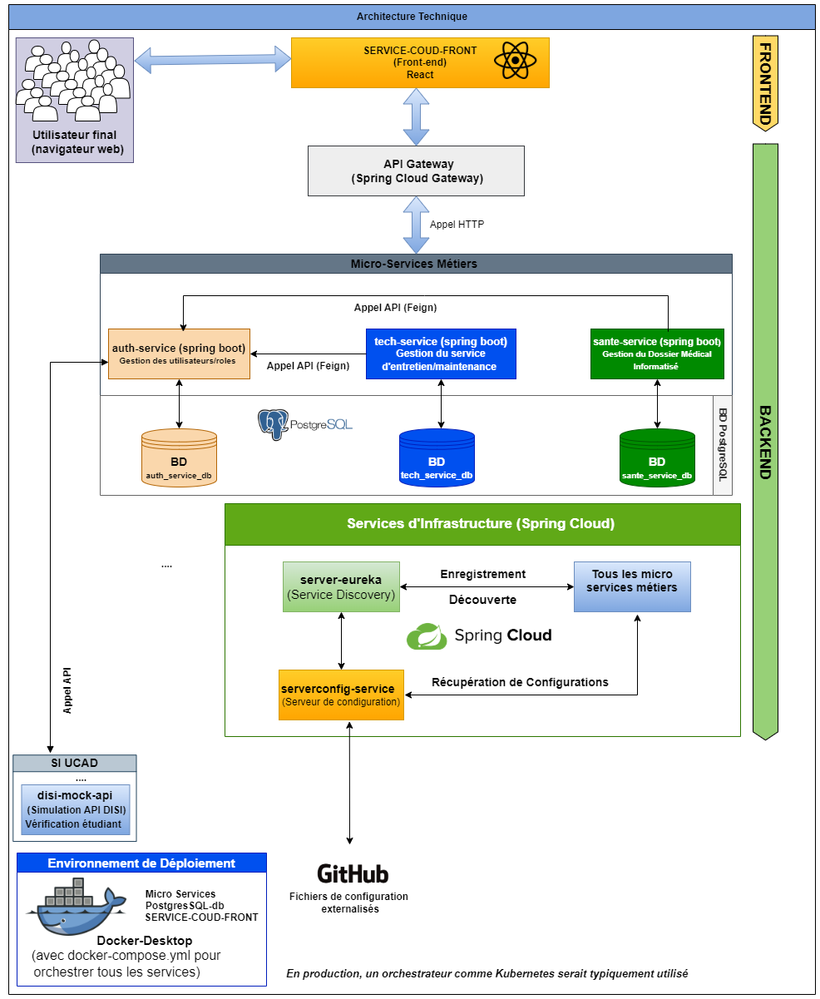

# 📘 Service-COUD

## 🧩 Présentation

**Service-COUD** est une application conçue pour centraliser les services du Centre des Œuvres Universitaires de Dakar (COUD). Elle vise à améliorer l’accès aux services administratifs, techniques et médicaux pour les étudiants et le personnel.

L’application repose sur une architecture **microservices** développée avec **Spring Boot**, garantissant modularité, évolutivité et performance.

---

## 🏗️ Architecture Générale

L’architecture de la solution est organisée autour de plusieurs microservices, chacun dédié à un domaine fonctionnel spécifique.

### 🔹 Microservices principaux

- **auth-service**  
  Gestion des utilisateurs, des rôles et des autorisations.  
  → Assure le contrôle d’accès à la plateforme.

- **tech-service**  
  Gestion des demandes d’interventions techniques.  
  → Permet la création, le suivi et la planification des requêtes.

- **sante-service**  
  Gestion du Dossier Médical Informatisé (DPI).  
  → Centralise les données médicales des étudiants.

Chaque microservice dispose de sa propre base de données, garantissant une indépendance et une meilleure scalabilité.

---

## 🔄 Communication et Interaction

L’interaction entre les différents composants repose sur une architecture fluide et sécurisée.

### 🎨 Frontend

- **SERVICE-COUD-FRONT**
- Développé avec **React**
- Point d’entrée unique pour les utilisateurs (étudiants et personnel)

### 🚪 API Gateway

- Implémentée avec **Spring Cloud Gateway**
- Rôle :
  - Point d’entrée unique des requêtes
  - Routage vers les microservices
  - Gestion de la sécurité
  - Filtrage et gestion des erreurs
  - Load balancing

### 🔗 Communication inter-services

- Communication via **HTTP/REST**
- Utilisation de **Feign Client** (Spring Cloud)
- Faible couplage entre les services

### 🏫 Intégration externe

- Interaction avec une API simulée du **DISI (UCAD)** :
  - Vérification du statut étudiant
  - Synchronisation des données académiques

---

## ⚙️ Services d’Infrastructure (Spring Cloud)

Pour garantir une architecture distribuée efficace, plusieurs composants d’infrastructure sont utilisés :

### 🔍 Service Discovery

- Basé sur **Eureka**
- Permet :
  - L’enregistrement automatique des services
  - La découverte dynamique des microservices
- Évite la configuration manuelle des adresses

### ⚙️ Configuration centralisée

- Utilisation d’un **Config Server**
- Configurations externalisées dans un dépôt Git
- Avantages :
  - Mise à jour sans redéploiement
  - Centralisation des paramètres

---

## 🐳 Environnement de Déploiement

L’application est entièrement conteneurisée avec **Docker**.

### 🚀 Déploiement local

- Orchestration via **docker-compose.yml**
- Permet :
  - Le démarrage automatique de tous les services
  - La gestion des dépendances
  - Une reproduction facile de l’environnement

### ☁️ Production

- Possibilité d’utiliser un orchestrateur comme **Kubernetes** pour :
  - Scalabilité
  - Haute disponibilité
  - Gestion avancée des conteneurs

---

## 🖼️ Schéma d’Architecture

Le diagramme ci-dessous illustre l’architecture technique globale de l’application :

---

## 🛠️ Technologies utilisées

- **Backend** : Spring Boot, Spring Cloud
- **Frontend** : React
- **Base de données** : PostgreSQL
- **Communication** : REST, Feign
- **Infrastructure** : Eureka, Config Server
- **Conteneurisation** : Docker, Docker Compose

---

## ✅ Objectifs du projet

- Centraliser les services du COUD
- Améliorer l’expérience utilisateur
- Assurer une architecture scalable et maintenable
- Faciliter l’intégration avec des systèmes externes

---

## 🎥 Démonstration

👉 Vidéo de démonstration :  
https://drive.google.com/your-demo-link